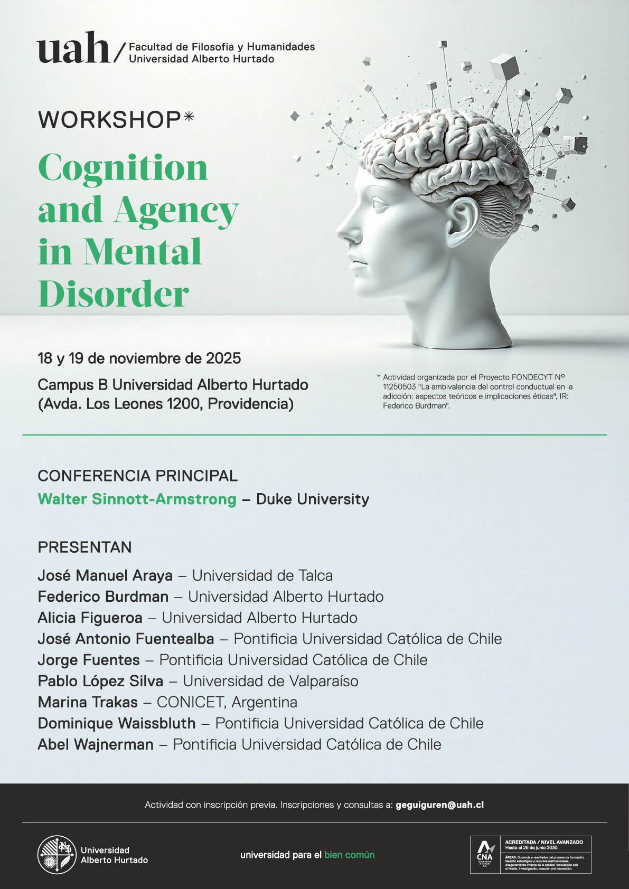

El 18 y 19 de noviembre de 2025, se realizará en el Campus B de la Universidad Alberto Hurtado (Avda. Los Leones 1200, Providencia) el workshop _Cognition and Agency in Mental Disorder_.

### Información

El evento se desarrollará en inglés.

Requiere registro previo. Para registro y consultas, escribir a: [geguiguren@uah.cl](mailto:geguiguren@uah.cl)

    
<a href="https://drive.google.com/file/d/1WEJwiovJ7a4JM1KN5Oa_OcmDU1f0oup_/view?usp=sharing">

Programa

</a>
<a href="https://drive.google.com/file/d/1qGeqe6pcrT6cvA7YPHxpHCHX_2qfAj7C/view?usp=sharing">    
    
Libro de resúmenes

</a>

